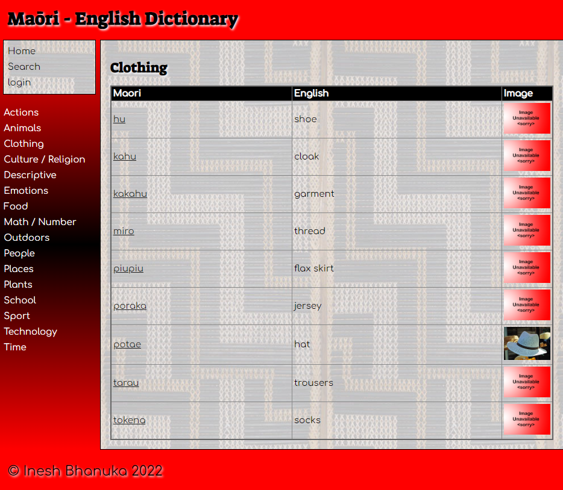

# **`Maōri - English Dictionary`**

 

The **`Maōri - English Dictionary`** is a **Python** application that is used to display and maintain **Maōri** to **English** dictionary data. Feel free to browse around this dictionary and discover the translations for a number of words.
If you wish to add words to this dictionary there is a login implemented in order to stop unauthorized additions to the database. 

 

The application consists of the following system **components**: 
 
1. `Database` - The *SqlLite* database that store the dictionary information.
2. `Migrations` - A utility module to generate some scripts to load database with initial data.
3. `Templates` -  The *HTML/Jinja2* which forms the application UI.
4. `Application` - The application consists of the following *Python* modules.
   * `app.py` - The application entry point module which handles all the *routs/end-points UI logic*.
   * `services.py` - This module supports the *app.py* by providing various required functionality and a controlled interface into database.
   * `data_access.py` - This module has all the database handling functions and is used by the *services.py* to fulfill application database requests.
 
 
 
The application is built using the following **technologies**:
*  - Application is primarily a bunch of **Python** modules.
*  - Application uses **Flask** web framework.
*  - Application uses **SqlLite** for database.
*  - Application UI is **HTML/Jinja2**.
*  - Application is styles using **CSS**.

[Above Badges/Logos are from this gitHub link](https://github.com/alexandresanlim/Badges4-README.md-Profile "Above Badges/Logos are from this gitHub link").